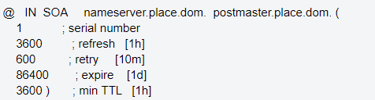
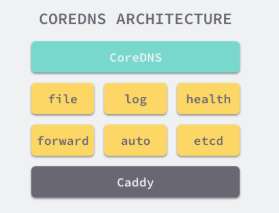

# DNS与CoreDNS #

## DNS ##

[https://tools.ietf.org/html/rfc1035](https://tools.ietf.org/html/rfc1035)

DNS(Domain Name System)是“域名系统”的英文缩写，，主要功能是将主机名或域名解析为IP地址。DNS是多层命名服务器构成的分布式数据库，属于应用层协议。

### DNS主要术语 ###

**顶级域名**

简称TLD，也就是“.”之后的结尾部分，常见的顶级域名包括com、net、org、gov、edu、co等。

**完全合格域名**

简称为FQDN，也就是我们所说的绝对域名。DNS系统中的域名可以彼此赋予，因此有时候其指向可能比较模糊。而FQDN则属于绝对名称，且位置关系指向域名系统的绝对root。这意味着其会指定每个主域名，包括顶级域名。一条正确的FQDN应以“.”结尾，同时指示DNS结构中的root，例如“mail.google.com”。有时候软件在调用时不要求FQDN以“.”结尾，但加上“.”更符合ICANN标准。

**区域文件**

区域文件是一个简单的文本文件，其中包含域名和IP地址的对应关系。

**SOA记录**

SOA（Start of Authority）记录表明了DNS服务器之间的关系。SOA记录保存了谁是这个区域的所有者。

SOA记录格式如下：

- serial number（序列号）：域名记录版本，每更改一次域名的任何DNS记录，版本号就会自动加一，这时secondary dns就会知道DNS记录发生更改，以便重新同步。 

- refresh（刷新时间）：告诉secondary dns多久应该查询primary dns，看看DNS记录是否有更新。每次查询时，secondary dns会向primary dns请求SOA记录。如果记录中的serial number跟secondary dns已有的序列号不一样，则会向primary dns请求传送域名的当前的DNS记录。

- retry（重试时间）：如果想primary dns请求传送域名当前的DNS记录失败后，间隔重试时间后再次重试请求。一般来说，retry小于refresh。

- expire（过期时间）：在过期时间之前，secondary dns会继续请求传送DNS记录，并且在此时间里，secondary dns会根据已有的记录应答相关的DNS查询。如果到了过期时间后，secondary dns会停止应答该域名的DNS查询。

- min TTL（最小TTL）：域名所有记录的最小生存时间值。当用户DNS查询到记录后，将存在缓存中，直到至少过了这个时间才将缓存刷新重新查询。

**A记录与AAA记录**

A记录用于记录IPv4地址与域名的对应关系，AAAA记录用于记录IPv6地址与域名的对应关系。

**CNAME记录**

别名记录，用于将某个别名指向到某个A记录上，这样就不需要再为某个新名字另外创建一条新的A记录。

**MX记录**

MX（Mail Exchanger Record）记录也叫做邮件路由记录，用户可以将该域名下的邮件服务器指向到自己的mail server上，然后即可自行操控所有的邮箱设置

**NS记录**

NS（Name Server）记录是域名服务器记录，用来指定该域名由哪个DNS服务器来进行解析。

**PTR记录**

PTR (Pointer Record)，指针记录，用于将一个IP地址映射到对应的域名，可看成是反向A记录，通过IP地址解析出域名。 PTR主要用于邮件服务器，比如邮箱AAA@XXX.com给邮箱BBB@yahoo.com发了一封邮件，yahoo邮件服务器接到邮件时会查看这封邮件的头文件，并分析是由哪个IP地址发出来的，然后根据这个IP地址进行反向解析，如果解析结果对应XXX.com的IP地址就接受这封邮件，反之则拒绝接收这封邮件。

**CAA记录**

[https://tools.ietf.org/html/rfc6844](https://tools.ietf.org/html/rfc6844)

CAA，全称Certificate Authority Authorization，即证书颁发机构授权。它为了改善PKI(Public Key Infrastructure：公钥基础设施)生态系统强度、减少证书意外错误发布的风险，通过DNS机制创建CAA资源记录，从而限定了特定域名颁发的证书和CA(证书颁发机构)之间的联系。从此，再也不能是任意CA都可以为任意域名颁发证书了。

CAA记录可以控制单域名SSL证书的发行，也可以控制通配符证书。当域名存在CAA记录时，则只允许在记录中列出的CA颁发针对该域名(或子域名)的证书。

**SRV记录**

[https://tools.ietf.org/html/rfc2782](https://tools.ietf.org/html/rfc2782)

服务位置记录，用于定义提供特定服务的服务器的位置，如主机(hostname)，端口(port number)等。

## CoreDNS ##

[https://coredns.io/](https://coredns.io/)

CoreDNS其实就是一个DNS服务，整个CoreDNS服务建立在一个使用Go编写的HTTP/2 Web服务器上。CoreDNS的大多数功能都是由插件来实现的，插件和服务本身都使用[Caddy](https://github.com/mholt/caddy)提供的一些功能，所以项目本身也不是特别的复杂。

CoreDNS架构如下：

CoreDNS通过四种方式对外直接提供DNS服务，分别是UDP、gRPC、HTTPS和TLS。
