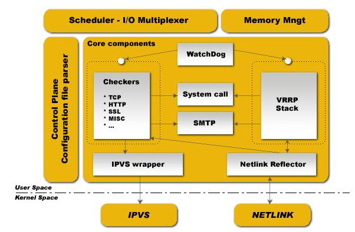

# Keepalived #

[http://www.keepalived.org/manpage.html](http://www.keepalived.org/manpage.html)

[http://www.keepalived.org/documentation.html](http://www.keepalived.org/documentation.html)


Keepalived起初是为LVS设计的，用于监控集群系统中各个服务节点的状态，后来Keepalived又加入了VRRP的功能，VRRP（Vritrual Router Redundancy Protocol,虚拟路由冗余协议)可以解决静态路由出现的单点故障问题，通过VRRP可以实现网络不间断稳定运行

注：VRRP相关内容移步到Network-->VRRP中复习

## Keepalived体系架构 ##


Keepalived 启动只有会有三个进程：

111	Keepalived	<-- Parent process monitoring children

112	\_ Keepalived	<-- VRRP child

113	\_ Keepalived	<-- Healthchecking child

父进程fork出子进程并进行监控，父进程也称为WatchDog。两个子进程会开启本地套接字Unix Domain Socket。keepalived服务启动后，父进程通过unxi domain socket每隔5秒发送一个"Hello"消息给子进程，如果父进程无法发送消息给子进程，将认为子进程出现问题，并会重启子进程。

Keepalived软件设计架构如下：




- Control Plane：keepalived配置文件是keepalived.conf，使用专门设计的编译器进行解析。解析器使用关键字树层次结构来使用特定的处理程序映射每个配置关键字。在解析过程中，配置文件被加载进内存中。

 
- Scheduler-I/O Multiplexer：Keepalived中所有事件都被发送到同一个进程中。keepalived是一个独立的进程，负责调度所有内部任务。


- Memory Management：这个框架提供一些通用的内存管理功能，比如内存分配、重新分配、释放等等。此框架有两种功能模式：正常模式和调试模式，当处于debug模式时，可以跟踪内存泄漏问题。


- WatchDog：此框架提供了子进程监控功能（VRRP & HealthChecking），父进程通过unxi domain socket每隔5秒发送一个"Hello"消息给子进程来检测子进程的健康状态。


- Checkers：这是keepalived的主要功能之一，其负责RealServer的健康检查，通过检测结构在LVS的拓扑中移除、添加RealServer，支持layer4/5/7层的协议检查。


- VRRP Stack：这是keepalived另一个主要功能，通过VRRP协议（RFC2338）实现Director的高可用。


- System call：提供读取自定义脚本的功能，主要用于MISC检查，其将临时产生一个子进程来执行对应任务，不影响全局调度计时器。


- SMTP：SMTP协议用于管理通知，为HealthChecker活动和VRRP协议状态转换发送通知给管理员。


- IPVS wrapper：这个框架负责将用户定于的配置文件中IPVS相关规则发送到内核的ipvs模块。


- Netlink Reflector：此模块用于VIP的设置、监控。

## 配置文件 ##

[https://www.iteye.com/blog/aoyouzi-2288124](https://www.iteye.com/blog/aoyouzi-2288124)

keepalived只有一个配置文件keepalived.conf，里面主要包括以下几个配置区域，分别是global_defs、static_ipaddress、static_routes、vrrp_script、vrrp_instance和virtual_server。

**global_defs**

```
global_defs {
    notification_email {
        a@abc.com
        b@abc.com
        ...
    }
    notification_email_from alert@abc.com
    smtp_server smtp.abc.com
    smtp_connect_timeout 30
    enable_traps
    router_id host163
}
```

- notification_email: 故障发生时给谁发邮件通知。
- notification_email_from: 通知邮件从哪个地址发出。
- smpt_server: 通知邮件的smtp地址。
- smtp_connect_timeout: 连接smtp服务器的超时时间。
- enable_traps: 开启SNMP陷阱（Simple Network Management Protocol）。
- router_id: 服务器标识。

**static_ipaddress和static_routes**

static_ipaddress和static_routes区域配置的是本节点的IP和路由信息。如果机器上已经配置了IP和路由，那么这两个区域可以不用配置。其实，一般情况下机器都会有IP地址和路由信息的，因此没必要再在这两个区域配置。

**vrrp_script**

用来做健康检查的，当时检查失败时会将vrrp_instance的priority减少相应的值。

```
vrrp_script chk_http_port {
    script "</dev/tcp/127.0.0.1/80"
    interval 1
    weight -10
}
```

**vrrp_instance和vrrp_sync_group**

vrrp_instance用来定义对外提供服务的VIP区域及其相关属性。vrrp_rsync_group用来定义vrrp_intance组，使得这个组内成员动作一致。例：两个vrrp_instance同属于一个vrrp_rsync_group，那么其中一个vrrp_instance发生故障切换时，另一个vrrp_instance也会跟着切换（即使这个instance没有发生故障）。

```
vrrp_sync_group VG_1 {
    group{
        inside_network   # name of vrrp_instance (below)
        outside_network  # One for each moveable IP.
        ...
    }
    notify_master /path/to_master.sh
    notify_backup /path/to_backup.sh
    notify_fault "/path/fault.sh VG_1"
    notify /path/notify.sh
    smtp_alert
}
vrrp_instance VI_1 {
    state MASTER
    interface eth0
    use_vmac <VMAC_INTERFACE>
    dont_track_primary
    track_interface {
        eth0
        eth1
    }
    mcast_src_ip <IPADDR>
    lvs_sync_daemon_interface eth1
    garp_master_delay 10
    virtual_router_id 1
    priority 100
    advert_int 1
    authentication {
        auth_type PASS
        auth_pass 12345678
    }
    virtual_ipaddress {
        10.210.214.253/24 brd 10.210.214.255 dev eth0
        192.168.1.11/24 brd 192.168.1.255 dev eth1
    }
    virtual_routes {
        172.16.0.0/12 via 10.210.214.1
        192.168.1.0/24 via 192.168.1.1 dev eth1
        default via 202.102.152.1
    }
    track_script {
        chk_http_port
    }
    nopreempt
    preempt_delay 300
    debug
    notify_master <STRING>|<QUOTED-STRING>
    notify_backup <STRING>|<QUOTED-STRING>
    notify_fault <STRING>|<QUOTED-STRING>
    notify <STRING>|<QUOTED-STRING>
    smtp_alert
}
```

- notify_master/backup/fault: 分别表示切换为主/备/出错时所执行的脚本。
- notify: 表示任何一状态切换时都会调用该脚本，并且该脚本在以上三个脚本执行完成之后进行调用，keepalived会自动传递三个参数（$1 = "GROUP"|"INSTANCE"，$2 = name of group or instance，$3 = target state of transition(MASTER/BACKUP/FAULT)）。
- smtp_alert: 表示是否开启邮件通知（用全局区域的邮件设置来发通知）。
- state: 可以是MASTER或BACKUP，不过当其他节点keepalived启动时会将priority比较大的节点选举为MASTER，因此该项其实没有实质用途。
- interface: 实例绑定的网卡，因为在配置虚拟IP的时候必须是在已有的网卡上添加的
- use_vmac: 是否使用VRRP的虚拟MAC地址。
- dont_track_primary: 忽略VRRP网卡错误。（默认未设置）
- track_interface: 跟踪接口，设置额外的监控，里面任意一块网卡出现问题，都会进入故障(FAULT)状态
- mcast_src_ip: 发送多播数据包时的源IP地址，默认源地址为master的IP。（由于是组播，因此即使修改了源地址，该master还是能收到回应的）
- lvs_sync_daemon_interface: 绑定lvs syncd的网卡。
- garp_master_delay: 当切为主状态后多久更新ARP缓存，默认5秒。
- virtual_router_id: 取值在0-255之间，用来区分多个instance的VRRP组播。
- priority: 设置本节点的优先级，该项取值范围是1-255（在此范围之外会被识别成默认值100）。
- advert_int： 发VRRP包的时间间隔，即多久进行一次master选举（可以认为是健康查检时间间隔）。
- authentication： 认证区域，认证类型有PASS和HA（IPSEC），推荐使用PASS（密码只识别前8位）。
- virtual_ipaddress： vip。
- virtual_routes： 虚拟路由，当IP漂过来之后需要添加的路由信息。
- virtual_ipaddress_excluded： 发送的VRRP包里不包含的IP地址，为减少回应VRRP包的个数。在网卡上绑定的IP地址比较多的时候用。
- nopreempt： 设置不抢占
- preempt_delay： master启动多久之后进行接管资源（VIP/Route信息等），并提是没有nopreempt选项。

**virtual_server_group和virtual_server**

```
virtual_server IP Port{
    delay_loop <INT>
    lb_algo rr|wrr|lc|wlc|lblc|sh|dh
    lb_kind NAT|DR|TUN
    persistence_timeout <INT>
    persistence_granularity <NETMASK>
    protocol TCP
    ha_suspend
    virtualhost <STRING>
    alpha
    omega
    quorum <INT>
    hysteresis <INT>
    quorum_up <STRING>|<QUOTED-STRING>
    quorum_down <STRING>|<QUOTED-STRING>
    sorry_server <IPADDR><PORT>
    real_server <IPADDR><PORT>{
        weight <INT>
        inhibit_on_failure
        notify_up <STRING>|<QUOTED-STRING>
        notify_down <STRING>|<QUOTED-STRING>
        # HTTP_GET|SSL_GET|TCP_CHECK|SMTP_CHECK|MISC_CHECK
        HTTP_GET|SSL_GET {
            url {
                path <STRING>
                # Digest computed with genhash
                digest <STRING>
                status_code <INT>
            }
            connect_port <PORT>
            connect_timeout <INT>
            nb_get_retry <INT>
            delay_before_retry <INT>
        }
    }
}
```

- delay_loop: 延迟轮询时间（单位秒）。
- lb_algo: 后端调试算法（rr|wrr|lc|wlc|lblc|sh|dh）。
- lb_kind: LVS调度类型（NAT/DR/TUN）。
- virtualhost: 用来给HTTP_GET或SSL_GET配置请求header（host）的。
- sorry_server: 当所有real server宕掉时，sorry server顶替。
- real_server: 真正提供服务的服务器。
- weight: 权重，0表示失效(不知给他转发请求知道他恢复正常)，默认是1。
- notify_up/down: 当real server宕掉或启动时执行的脚本。

健康检查（HTTP_GET|SSL_GET|TCP_CHECK|SMTP_CHECK|MISC_CHECK）：

HTTP_GET：

```
HTTP_GET                                                     #健康检查方式
{
  url {                                                      #要坚持的URL，可以有多个
  path /                                                     #具体路径
  digest <STRING>                                            
  status_code 200                                            #返回状态码
}
connect_port 80                                              #监控检查的端口
bindto <IPADD>                                               #健康检查的IP地址
connect_timeout   3                                          #连接超时时间
nb_get_retry 3                                               #重连次数
delay_before_retry 2                                         #重连间隔
} # END OF HTTP_GET|SSL_GET
```

TCP_CHECK：
```
TCP_CHECK {
  connect_port 80
  bindto 192.168.1.1
  connect_timeout 4
}
```

SMTP_CHECK:
```
SMTP_CHECK
host {
  connect_ip <IP ADDRESS>
  connect_port <PORT>                                     #默认检查25端口
  14 KEEPALIVED
  bindto <IP ADDRESS>
}
connect_timeout <INTEGER>
retry <INTEGER>
delay_before_retry <INTEGER>
helo_name <STRING>|<QUOTED-STRING>
}
```

MISC_CHECK:
```
MISC_CHECK
{
misc_path <STRING>|<QUOTED-STRING>                    #外部程序或脚本
misc_timeout <INT>                                    #脚本或程序执行超时时间

misc_dynamic                                          #可以非常精确的来调整权重，是后端每天服务器的压力都能均衡调配，这个主要是通过执行的程序或脚本返回的状态代码来动态调整weight值，使权重根据真实的后端压力来适当调整
#返回0：健康检查没问题，不修改权重
#返回1：健康检查失败，权重设置为0
#返回2-255：健康检查没问题，但是权重却要根据返回代码修改为返回码-2，例如如果程序或脚本执行后返回的代码为200，#那么权重这回被修改为 200-2
}
```