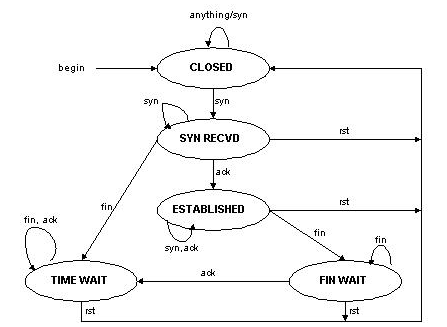
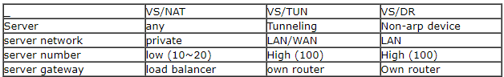

# LVS的工作模式与调度算法 #

## 工作模式 ##

**Virtual Server via Network Address Translation（VS/NAT）**

这个工作模式通过NAT来实现，调度器通过调度算法计算之后，重写数据包的目的IP地址和目的端口，将数据包转发给后端真实服务器；当服务器的响应报文经过调度器时，调度器会重写数据包的源IP地址和源端口，再将数据包发送出去。

调度器处理到来的第一个报文时会在hash表中记录这个连接，当这个连接的下一个数据包过来时，调度器会将数据包发送给同一台后端服务器。LVS采用了标准的TCP状态机（TCP状态机可参考[TCP连接的建立与终止](https://github.com/SecurityNeo/ReadingNotes/blob/master/TCPIP/TCP-IP%E8%AF%A6%E8%A7%A3%E5%8D%B71%E5%8D%8F%E8%AE%AE/%E5%8D%81%E4%B8%80%E3%80%81TCP%E8%BF%9E%E6%8E%A5%E7%9A%84%E5%BB%BA%E7%AB%8B%E4%B8%8E%E7%BB%88%E6%AD%A2.xmind)），当连接终止或者超时后，调度器会将hash表中的这个连接删除。

**Virtual Server via Direct Routing（VS/DR）**

当客户端请求数据包到达LVS时，调度器经过调度算法计算之后，重写数据包的目的MAC地址，再将数据包转发给后端真实服务器；服务器的响应报文会直接发送给客户端。

这种工作方式能极大地提高集群的吞度量。但有几点需要注意：

- 后端服务器组与调度器必须有一个网卡在同一个局域网内；
- 虚IP为调度器与后端服务器组共享；
- 所有后端服务器组需要把虚IP配置在自己的Non-ARP网络设备上，对外不可见，以确保服务器在封装响应报文时源IP仍然为虚IP

**Virtual Server via IP Tunneling（VS/TUN）**

使用VS/NAT模式时，调度器需要重写请求报文的目的IP端口和响应报文的IP端口，同时还需要记录每个连接状态，当请求量很大时，这势必会极大地影响到集群的总体性能。VS/TUN模式能解决这个问题，当请求报文到达调度器时，调度器通过IP隧道将请求报文转发至真实服务器，而真实服务器将响应直接返回给客户，调度器只负责处理请求报文。

IP隧道（IP tunneling）将IP报文封装在另一个IP报文之内，使得目标为一个IP地址的数据报文能被封装和转发到另一个IP地址。IP隧道一般为一个静态通道，但在LVS的架构中，后端是一个服务器组而非一台服务器，不可能静态创建一个一一对应的IP隧道，而是动态地选择一台服务器，将请求报文封装和转发给选出的服务器。

TCP的半连接状态变迁如下：

官方三种负载均衡技术比较总结表：

